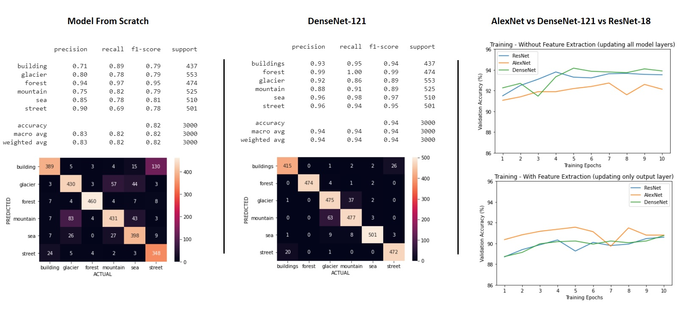

DenseNet-121 neural network architecture and more generally pretrained neural networks have shown >90% accuracy in this image classification task. Finetuning all model layers is clearly an option to consider when dealing with a big enough training dataset (14033 images in this excercise), as the model can learn from data that is specific to the use case and achieve better performance.

**DenseNet-121 with finetuning achieves an overall classification accuracy of 94.17% while the model built from scratch is only 82.4% accurate.**

Keras provides a relatively simple and fast implementation of neural network procedures while PyTorch requires low-level data and model manipulation.
